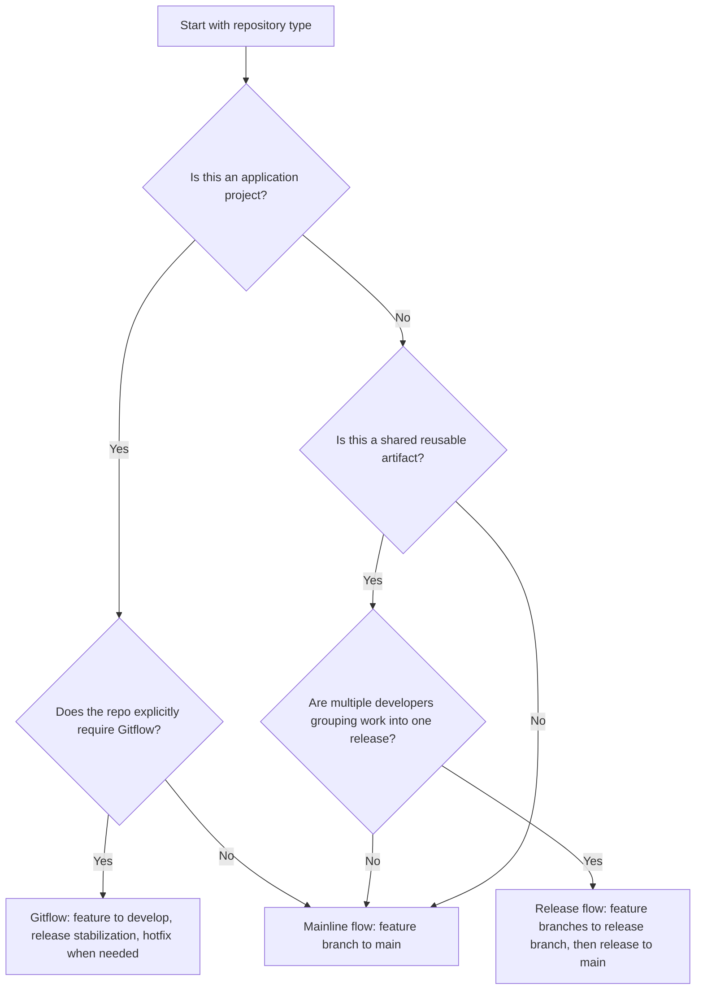
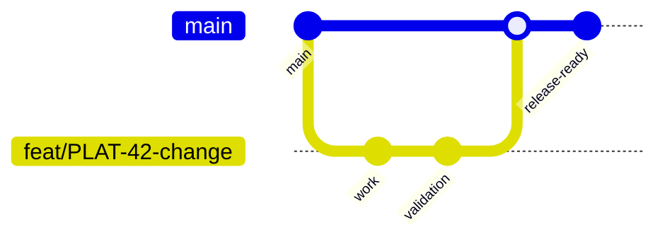
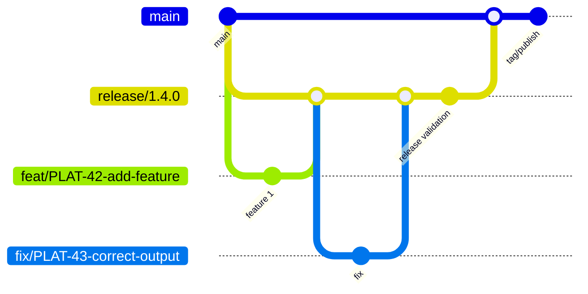
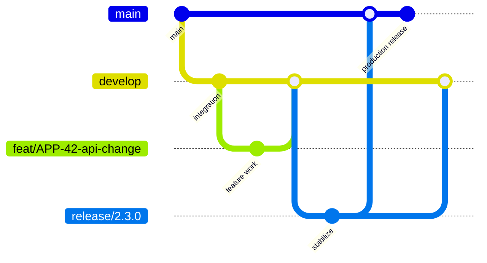

# Contribution workflow

This page covers the rules for creating branches, writing commits, opening pull requests, and reporting issues.

## At a glance

- Branch from `main` using a short-lived feature, fix, hotfix, or chore branch.
- Use conventional commits for commit messages.
- Keep Jira keys visible in branch names and PR titles when applicable.
- Use the pull request template for every PR.
- Link related issues and related PRs where relevant.
- Report issues before opening a PR when the work needs tracking or discussion.

## Branch model

Use the simplest branch model that supports the repository's release needs.

Infrastructure, documentation, solo-maintained Terraform modules, solo Chef cookbooks, solo Ansible playbooks, and similar repositories should use a single long-lived `main` branch with short-lived feature branches.

Reusable artifacts with grouped release work may use a release branch. This is common when multiple developers are contributing to the same Terraform module, Chef cookbook, Ansible playbook, or similar reusable artifact.

Application repositories may use Gitflow when the repository needs staged integration, release stabilization, production hotfixes, or environment promotion. If a repository deviates, document the exception in its local `CONTRIBUTING.md`.



| Repository type | Default branch model |
|-----------------|----------------------|
| Documentation site | Mainline |
| Solo Terraform module | Mainline |
| Solo Chef cookbook | Mainline |
| Solo Ansible playbook | Mainline |
| Shared Terraform module with multiple contributors | Release branch |
| Shared Chef cookbook with multiple contributors | Release branch |
| Shared Ansible playbook with multiple contributors | Release branch |
| Application service | Gitflow when explicitly required |

### Mainline flow

Use this for single-maintainer repositories and small changes.

1. Branch from `main`.
2. Open a pull request back to `main`.
3. Run validation before merge.
4. Merge to `main`.
5. Let release automation publish from `main` when configured.



### Release branch flow

Use this when a reusable artifact needs multiple features stabilized together before release.

1. Create `release/<version-or-name>` from `main`.
2. Create feature branches from the release branch.
3. Merge feature branches into the release branch.
4. Validate the release branch as a whole.
5. Merge the release branch into `main` as the release candidate or final release.
6. Tag or publish from `main` when release automation requires it.



### Application Gitflow

Use Gitflow only when the application repository needs staged integration, release stabilization, and production hotfix handling.

A typical application flow uses:

- `main` for production-ready code
- `develop` for integrated work not yet released
- `feature/*` for individual changes
- `release/*` for stabilization
- `hotfix/*` for urgent production fixes

Repositories that use Gitflow must document their exact branch rules in their local `CONTRIBUTING.md`.



### Common rules

- `main` must always stay deployable.
- Nothing is committed directly to `main`.
- All changes enter through a pull request.
- Branch names should clearly identify the change and its ticket.
- Release branches are temporary and should be deleted after the release is merged and published.
- Application repositories that use Gitflow must keep branch rules documented in the local repository.

## Branch naming

Use this format:

```text
<type>/<JIRA-ID>-<short-description>
```

### Branch types

- `feat/` for new capability
- `fix/` for bug fixes
- `hotfix/` for urgent production fixes
- `chore/` for maintenance or non-functional changes

### Examples

```text
feat/PLAT-42-add-vault-dynamic-secrets
fix/PLAT-101-correct-s3-bucket-policy
hotfix/PLAT-210-patch-iam-privilege-escalation
chore/PLAT-88-bump-terraform-aws-provider
```

### Rules

- Use lowercase only.
- Use hyphens as separators.
- Keep the description short but meaningful.
- Include the Jira key immediately after the branch type.
- Keep the same Jira key visible in the pull request title when applicable.

## Commit messages

Use conventional commits.

```text
<type>: <short summary in present tense>

<optional body>

<optional footer>
```

### Examples

```text
feat: add KV v2 secret read on application startup

fix: correct IAM policy ARN format for cross-account role

chore: bump hashicorp/aws provider to 5.58.0

feat!: remove support for Vault KV v1
```

### Rules

- Use the imperative present tense.
- Keep the subject under 72 characters.
- Do not end the subject with a period.
- Use the body to explain why, not what.
- Use `BREAKING CHANGE:` in the footer for breaking changes.

## Pull request titles

Use this format:

```text
<type>[!]: [JIRA-ID] <description>
```

### Examples

```text
feat: PLAT-42 add Vault dynamic database credentials
fix: PLAT-101 correct S3 bucket ACL configuration
feat!: PLAT-200 remove Terraform 1.4 compatibility
chore: bump pre-commit hook versions
```

### Rules

- Keep titles short and present tense.
- Include the Jira key when one exists.
- Use `!` only for breaking changes.
- Follow the repository’s validation rules if a workflow enforces the title format.

## Pull request descriptions

Use the repository pull request template when one exists. Keep the description structured and specific.

### Suggested fields

- Summary
- Changes
- Related issues
- Related pull requests
- Testing
- Documentation
- Breaking changes

## Reporting issues

Use [Reporting an issue](reporting-a-issue.md) to open Jira Cloud issues for bugs, documentation gaps, and change requests. Follow the issue template there so the report includes reproducible steps, expected results, actual results, and relevant tooling versions.

For work items that are not issue reports, use [Work items](jira-work-items.md) to format epics, stories, and bugs consistently. That page also defines the story acceptance criteria and SMART guidance.

## Review checklist

Before opening a pull request, confirm:

- The branch name follows the repository convention.
- The commit messages are clear and atomic.
- The pull request title matches the expected format.
- Related Jira issues are linked if applicable.
- Tests have been run or updated.
- Documentation has been updated where needed.
- No secrets or environment-specific values are committed.

## For automated coding tools

- Inspect the repository's local `CONTRIBUTING.md` before assuming a branch model.
- If no local rule exists, default to mainline flow for infrastructure, documentation, Terraform, Chef, and Ansible repositories.
- Use a release branch only when the user or repository policy indicates grouped release work.
- Use Gitflow for application repositories only when the repository explicitly requires it.
- Do not create `develop`, `release/*`, or `hotfix/*` branches unless the workflow calls for them.
- Keep the Jira key visible in branch names and pull request titles when one exists.
