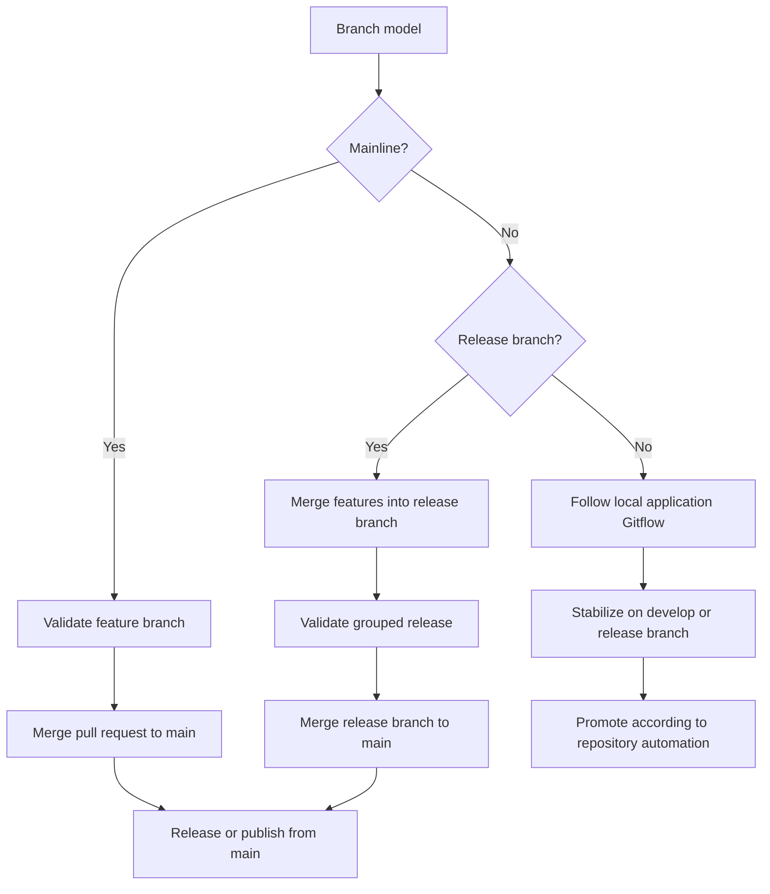

# Release workflow

This page explains how pull request titles, merge commits, and release automation work together.

## Semantic versioning

Repositories use Semantic Versioning 2.0.0 unless a repository explicitly documents a different rule.

### Version bumps

- `MAJOR` for breaking changes
- `MINOR` for backward-compatible new features
- `PATCH` for backward-compatible fixes

## Merge and release behavior

The merge commit should preserve the information the release workflow needs to determine the next version.

### Rules

- Keep the release signal visible in the PR title and merge commit when automation depends on it.
- Do not rewrite release metadata in a way that breaks traceability.
- Treat the merge commit as part of the release record.

## Branch model and release behavior

The branch model determines where release automation runs and where release readiness is proven.

- Mainline repositories usually release from `main`.
- Release-branch repositories validate grouped work on `release/*` and publish after the release branch merges to `main`.
- Application Gitflow repositories may release from `release/*` or `main`, depending on repository automation.
- Repository-local workflows must document which branch triggers release automation.

## GitHub Actions automation

Some repositories use GitHub Actions to determine version bumps and generate release output.

### What the workflow does

- Reads the merge commit or PR title
- Determines the release type
- Updates changelog or release notes
- Publishes the new version or release artifact

## Breaking changes

Use the repository’s breaking-change convention consistently.

### Examples

- `feat!` in the commit or PR title
- `BREAKING CHANGE:` in the commit footer
- explicit migration notes in the pull request description

## Repository-specific notes

Some repositories may layer extra behavior on top of this workflow.

### Examples

- Terraform repositories may follow module-specific release rules
- Documentation repositories may not publish versioned releases
- Application repositories may use different branch models but the same versioning semantics
