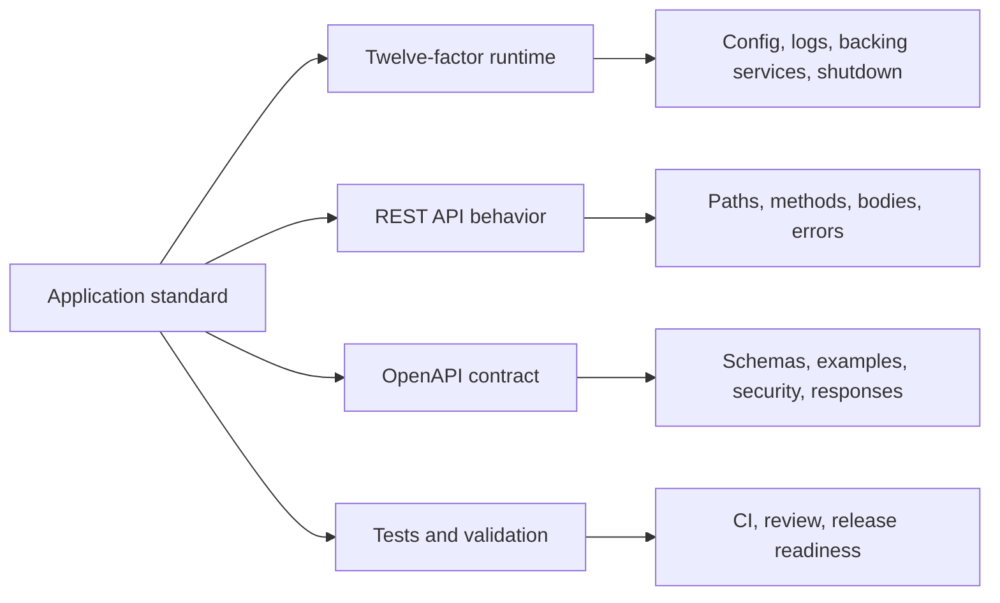

# Application standards

Use these standards when designing, building, generating, reviewing, or maintaining services, REST APIs, background jobs, and supporting application code in any programming language.

The goal is predictable application behavior. A service should be easy to configure, easy to run, easy to observe, easy to document, and easy for another team or tool to consume without reading the implementation first.

## What lives here

- [Twelve-factor application practices](twelve-factor.md)
- [REST API standard](rest-api.md)
- [OpenAPI standard](openapi.md)
- [Service checklist](checklist.md)

## Recommended order

1. Read [Twelve-factor application practices](twelve-factor.md) before designing a service runtime, configuration model, dependency boundary, or deployment path.
2. Use the [REST API standard](rest-api.md) when designing or changing HTTP APIs.
3. Use the [OpenAPI standard](openapi.md) when writing or updating the API contract.
4. Use the [Service checklist](checklist.md) before coding, review, and merge.

## How to apply this standard

These standards are language-agnostic. Go, Python, Java, TypeScript, Ruby, and other language standards may add implementation details, but they should not redefine the service contract.

Before creating or changing application code:

- inspect the existing repository layout, framework choices, configuration style, logging fields, test patterns, and OpenAPI documents
- preserve repository-local conventions unless the change intentionally updates them
- avoid new dependencies, frameworks, generators, databases, queues, caches, or runtime services without approval
- prefer the smallest change that satisfies the behavior and keeps the review clear
- update documentation, OpenAPI contracts, and tests in the same change when behavior changes
- document operational or product tradeoffs in the pull request when they affect reliability, security, compatibility, or support

Application repositories may use Gitflow when the repository requires staged integration, release stabilization, or hotfix handling. Use the branch model documented in the repository's `CONTRIBUTING.md`; otherwise follow the shared [contribution workflow](../../contributing-releases/contribution-workflow.md).

Approval means one of the following is true:

- the repository already uses the pattern or dependency
- the user explicitly requested it
- a project maintainer accepted it in review or design discussion
- a Jira work item, architecture decision, or design note records the decision

## Related principles

- [Prioritize security](../../principles/01-security.md)
- [Testing](../../principles/03-testing.md)
- [Repeatability and portability](../../principles/04-repeatability.md)
- [Agnostic](../../principles/07-agnostic.md)
- [Observability](../../principles/08-observability.md)
- [Metrics](../../principles/09-metrics.md)

## For automated coding tools

- Inspect the repository before generating application code.
- Preserve local conventions over generic examples.
- Follow this application standard when no narrower repository standard exists.
- Do not add dependencies, frameworks, generators, runtime services, background workers, or global mutable state without approval.
- Follow the OpenAPI contract when one exists.
- Update the OpenAPI contract when request behavior, response behavior, status codes, authentication, authorization, or error shape changes.
- Add or update tests for changed application behavior.
- Show which validation commands were run.
- Call out validation that could not be run.
