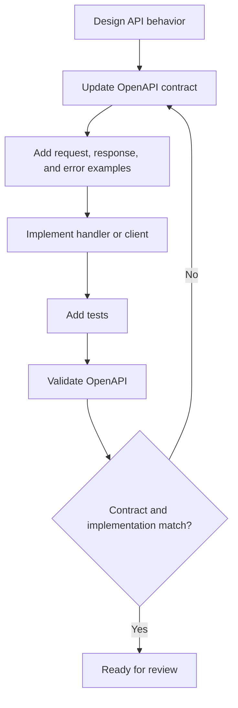

# OpenAPI standard

Use this standard when writing, generating, reviewing, or changing OpenAPI documents for REST APIs.

OpenAPI is the API contract. It describes supported client behavior, not internal implementation. If the implementation changes the public request, response, status code, authentication, authorization, or error behavior, the OpenAPI document changes in the same pull request.

## Intent

OpenAPI should make an API understandable without reading the service code. A consumer should be able to identify available operations, required authentication, request bodies, response bodies, errors, examples, and compatibility expectations from the contract.

## Contract-first workflow

- Design the API contract before or alongside implementation.
- Treat OpenAPI changes as part of the code review, not generated after the fact.
- Keep examples realistic and safe.
- Validate the OpenAPI document in CI when the repository supports it.
- Use generated code only when the repository explicitly opts in.



## Required document structure

Each OpenAPI document should define:

- `openapi`
- `info.title`
- `info.version`
- `servers` when the repository standard requires them
- `paths`
- `components.schemas` for reusable request, response, and error shapes
- `components.parameters` for reused path, query, or header parameters
- `components.responses` for common error responses
- `components.securitySchemes` when authentication is required

Good:

```yaml
openapi: 3.1.0
info:
  title: Account API
  version: 1.0.0
paths:
  /accounts/{account_id}/users:
    get:
      operationId: listAccountUsers
      summary: List account users
      parameters:
        - $ref: '#/components/parameters/AccountId'
      responses:
        '200':
          description: Account users returned successfully.
          content:
            application/json:
              schema:
                $ref: '#/components/schemas/UserCollection'
        '401':
          $ref: '#/components/responses/Unauthorized'
        '403':
          $ref: '#/components/responses/Forbidden'
        '404':
          $ref: '#/components/responses/AccountNotFound'
components:
  parameters:
    AccountId:
      name: account_id
      in: path
      required: true
      schema:
        type: string
  schemas:
    UserCollection:
      type: object
      required:
        - data
      properties:
        data:
          type: array
          items:
            $ref: '#/components/schemas/User'
    User:
      type: object
      required:
        - id
        - email
        - display_name
        - role
      properties:
        id:
          type: string
        email:
          type: string
          format: email
        display_name:
          type: string
        role:
          type: string
          enum:
            - admin
            - editor
            - viewer
```

Why this is good:

- The operation has a stable `operationId`.
- Shared parameters and schemas are reusable.
- Response behavior is documented explicitly.
- The schema describes required fields and enum values.

Bad:

```yaml
paths:
  /getUsers:
    get:
      responses:
        '200':
          description: ok
```

Why this is bad:

- The path is action-oriented.
- There is no `operationId`.
- There are no request, response, error, or authentication details.
- Clients cannot generate useful documentation or tests from it.

## Naming conventions

- Use stable, descriptive `operationId` values such as `listAccountUsers` or `createAccountUser`.
- Use schema names that describe business concepts, such as `User`, `CreateUserRequest`, and `ErrorResponse`.
- Use parameter names that match the REST API path, such as `account_id`.
- Use consistent JSON field naming within a repository.
- Avoid temporary names, implementation names, database table names, and framework names.

## Paths and operations

Each operation must include:

- `operationId`
- `summary`
- `description` when the behavior has important constraints
- path parameters for every templated path segment
- query parameters for filtering, sorting, pagination, or field selection
- request body schema when a body is accepted
- success responses
- expected error responses
- security requirements when authentication or authorization applies
- examples for common success and failure behavior

## Schemas

- Put reusable request, response, and error shapes under `components.schemas`.
- Mark required fields explicitly.
- Use `format` when it clarifies values, such as `date-time`, `email`, or `uuid`.
- Use enums only for stable public values.
- Do not expose internal enum names, database status codes, or framework-specific values.
- Prefer additive schema evolution.
- Do not reuse the same schema for create, update, and response bodies when their required fields or server-managed fields differ.

Good:

```yaml
CreateUserRequest:
  type: object
  required:
    - email
    - display_name
    - role
  properties:
    email:
      type: string
      format: email
    display_name:
      type: string
      minLength: 1
    role:
      type: string
      enum:
        - admin
        - editor
        - viewer
```

Bad:

```yaml
UserPayload:
  type: object
  additionalProperties: true
```

Why this is bad:

- It does not document required fields.
- It allows undocumented fields.
- It cannot drive useful validation, examples, or client generation.

## Parameters

- Define repeated path, query, and header parameters under `components.parameters`.
- Mark path parameters as `required: true`.
- Document pagination parameters consistently.
- Use clear descriptions when a value has constraints that are not obvious from the schema.
- Avoid putting authentication credentials in query parameters.

## Responses

- Document every success response the operation can return.
- Document common error responses using reusable components.
- Include `content` and schema definitions for JSON bodies.
- Use `204 No Content` only when there is no response body.
- Do not document impossible status codes just to make the contract look complete.

## Errors

All API error responses should use the shared error shape from the [REST API standard](rest-api.md#error-responses).

Good:

```yaml
ErrorResponse:
  type: object
  required:
    - error
  properties:
    error:
      type: object
      required:
        - code
        - message
      properties:
        code:
          type: string
          example: validation_failed
        message:
          type: string
          example: The request body contains invalid fields.
        details:
          type: array
          items:
            type: object
            required:
              - field
              - reason
            properties:
              field:
                type: string
              reason:
                type: string
        request_id:
          type: string
          example: req_01J2Z8Y7ABCDEF
```

Why this is good:

- The error shape is reusable.
- Machine-readable and human-readable fields are separate.
- Field-level validation details are documented.
- Request correlation is part of the contract when available.

## Security schemes

- Define authentication under `components.securitySchemes`.
- Apply security requirements globally or per operation intentionally.
- Document when an operation is public.
- Do not include real tokens, keys, passwords, account IDs, or customer data in examples.
- Document authorization errors with `401` and `403` responses where applicable.

## Examples

Every OpenAPI operation should include realistic examples for:

- successful requests
- successful responses
- validation failures
- authentication or authorization failures when applicable
- not found responses when the operation reads or modifies a specific resource

Good validation error example:

```yaml
ValidationFailedExample:
  summary: Invalid user request
  value:
    error:
      code: validation_failed
      message: The request body contains invalid fields.
      details:
        - field: email
          reason: must be a valid email address
        - field: role
          reason: 'must be one of: admin, editor, viewer'
      request_id: req_01J2Z8Y7ABCDEF
```

Bad example:

```yaml
ErrorExample:
  value:
    error: something went wrong
```

Why this is bad:

- It does not match the required error shape.
- It does not show a stable error code.
- It does not help clients implement useful handling.

## Versioning and compatibility

- Keep `info.version` current with the API contract versioning strategy.
- Treat field removals, changed meanings, narrowed enum values, new required fields, and changed status codes as breaking changes.
- Prefer additive changes when possible.
- Document deprecations before removal.
- Keep old and new behavior documented during migration periods.

## Contract validation

Repositories that own REST APIs should validate OpenAPI documents in CI when practical.

Validation should check:

- syntax and schema validity
- unresolved references
- missing `operationId` values
- missing schemas for request and response bodies
- missing common error responses
- examples that do not match schemas
- breaking changes when the repository has a compatibility gate

## Generated code policy

- Do not introduce generated server or client code unless the repository explicitly opts in.
- Generated code must have a clear regeneration command.
- Generated code must be reviewed as an artifact of the contract, not edited by hand unless the repository standard says otherwise.
- Do not add generated code when a small handwritten handler, client, or schema update is enough.

## For automated coding tools

- Inspect existing OpenAPI documents before generating API code.
- Preserve existing schema naming, field naming, status code, and example conventions.
- Update OpenAPI in the same change as API behavior.
- Add realistic success and error examples.
- Do not include secrets, production data, stack traces, SQL errors, package names, hostnames, or internal file paths in examples.
- Do not introduce code generators unless approved.
- Show which OpenAPI validation commands were run.
- Call out validation that could not be run.
