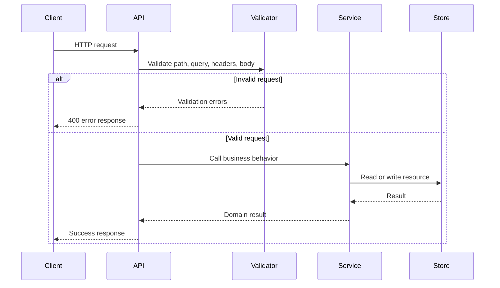

# REST API standard

Use this standard when designing, generating, reviewing, or changing REST APIs in any programming language.

An API is not done when the handler works locally. It is done when the resource model is clear, the contract is documented, invalid input fails predictably, errors are safe to expose, logs are useful, and another client can consume the API without reading the implementation.

## Intent

REST APIs should be predictable. Clients should be able to infer how to read, create, update, delete, filter, and page through resources from consistent paths, HTTP methods, status codes, JSON bodies, and OpenAPI contracts.

Repository-local API conventions still matter. Preserve existing conventions unless the change intentionally updates the API standard for that repository.



## Resource paths

Design paths around resources, not implementation actions.

Good:

```http
GET /accounts
GET /accounts/{account_id}
GET /accounts/{account_id}/users
POST /accounts/{account_id}/users
DELETE /accounts/{account_id}/users/{user_id}
```

Why this is good:

- The path describes resources.
- Resource identity is represented with path parameters.
- The HTTP method describes the action.
- The path does not expose database tables, package names, controller names, or service internals.

Bad:

```http
GET /getAccounts
POST /createAccountUser
POST /account/deleteUser
GET /api/v1/accountService/usersByAccountId
```

Why this is bad:

- Verbs are embedded in the path instead of represented by HTTP methods.
- Naming is inconsistent.
- Internal implementation details leak into the API.
- The path is harder to document and harder for clients to predict.

### Path rules

- Use plural nouns for collections, such as `/accounts` and `/users`.
- Use path parameters for resource identity.
- Use query parameters for filtering, sorting, pagination, and field selection.
- Use lowercase path segments with hyphens only when a multiword static segment is necessary.
- Avoid file extensions in API paths.
- Avoid exposing database tables, package names, controller names, or internal service names.
- Avoid action words in paths when an HTTP method can express the operation.

## HTTP methods

Use HTTP methods consistently.

| Method | Use for | Expected behavior |
|--------|---------|-------------------|
| `GET` | Reading one resource or a collection | Safe and idempotent |
| `POST` | Creating resources or starting non-idempotent operations | Not automatically idempotent |
| `PUT` | Replacing a resource | Idempotent |
| `PATCH` | Partially updating a resource | Idempotent when the patch format supports it |
| `DELETE` | Removing, disabling, or scheduling deletion of a resource | Idempotent from the client perspective when practical |

Good:

```http
POST /accounts/{account_id}/users
```

Bad:

```http
GET /accounts/{account_id}/create-user
```

Why this is bad:

- `GET` must not create or mutate server state.
- Clients, caches, and crawlers may treat `GET` as safe to retry or prefetch.

## Request bodies

Request bodies should describe client intent clearly and use stable field names.

Good:

```json
{
  "email": "alex@example.com",
  "display_name": "Alex Rivera",
  "role": "viewer"
}
```

Why this is good:

- The payload uses clear business names.
- The fields are stable and easy to document in OpenAPI.
- The request does not include server-managed fields.
- The role value is readable without a database lookup.

Bad:

```json
{
  "userEmailString": "alex@example.com",
  "name_temp": "Alex Rivera",
  "role_id": 3,
  "created_at": "2026-06-24T12:00:00Z"
}
```

Why this is bad:

- Field names expose implementation details and inconsistent naming.
- Temporary names become long-term API contracts.
- Numeric role IDs require client-side knowledge that must be documented or avoided.
- `created_at` should be assigned by the server unless the API explicitly accepts imported historical data.

### Request body rules

- Use JSON objects for structured request bodies.
- Use stable field names that describe business meaning.
- Do not require clients to send server-managed fields such as IDs, timestamps, version counters, or audit fields unless the operation explicitly supports import or migration behavior.
- Do not accept fields that the server ignores silently.
- Validate the body at the API boundary before calling business logic.
- Reject malformed JSON with a clear `400 Bad Request` response.

## Response bodies

Responses should be predictable, documented, and safe to expose.

Good:

```json
{
  "id": "usr_123",
  "email": "alex@example.com",
  "display_name": "Alex Rivera",
  "role": "viewer",
  "created_at": "2026-06-24T12:00:00Z"
}
```

Why this is good:

- The response has stable fields.
- Server-managed fields are returned by the server.
- The shape can be documented directly in OpenAPI.
- The response does not expose secrets or internal state.

Bad:

```json
{
  "user_id": 123,
  "email_address": "alex@example.com",
  "password_hash": "$2a$10$example",
  "db_status": 1,
  "internal_notes": "created by seed job"
}
```

Why this is bad:

- Sensitive data is exposed.
- Internal database state leaks into the contract.
- Field naming is inconsistent with the request.
- Clients may begin depending on implementation details.

### Collection response example

Good:

```json
{
  "data": [
    {
      "id": "usr_123",
      "email": "alex@example.com",
      "display_name": "Alex Rivera",
      "role": "viewer"
    }
  ],
  "pagination": {
    "limit": 25,
    "next_cursor": "eyJpZCI6InVzcl8xMjMifQ"
  }
}
```

Why this is good:

- Collection metadata is separate from resource data.
- Pagination can evolve without changing each item shape.
- The response can be documented with reusable OpenAPI schemas.

## Status codes

Use status codes consistently and document them in OpenAPI.

| Status | Use for |
|--------|---------|
| `200 OK` | Successful reads, replacements, partial updates, and operations returning a body |
| `201 Created` | Successful resource creation |
| `202 Accepted` | Work accepted for asynchronous processing |
| `204 No Content` | Successful operation with no response body |
| `400 Bad Request` | Malformed JSON, invalid query parameters, or invalid request shape |
| `401 Unauthorized` | Missing, invalid, or expired authentication |
| `403 Forbidden` | Authenticated caller lacks permission |
| `404 Not Found` | Resource does not exist or is intentionally hidden from the caller |
| `409 Conflict` | Request conflicts with current resource state |
| `422 Unprocessable Entity` | Semantically invalid body when the repository explicitly distinguishes this from `400` |
| `429 Too Many Requests` | Caller exceeded rate limits |
| `500 Internal Server Error` | Unexpected server failure |

Prefer one validation status strategy per repository. If the repository does not already distinguish `400` and `422`, use `400 Bad Request` for validation failures.

## Error responses

Error responses must be clear, consistent, machine-readable, and safe to expose.

Required shape:

```json
{
  "error": {
    "code": "validation_failed",
    "message": "The request body contains invalid fields.",
    "request_id": "req_01J2Z8Y7ABCDEF"
  }
}
```

Use `details` when the client needs field-level or item-level feedback:

```json
{
  "error": {
    "code": "validation_failed",
    "message": "The request body contains invalid fields.",
    "details": [
      {
        "field": "email",
        "reason": "must be a valid email address"
      }
    ],
    "request_id": "req_01J2Z8Y7ABCDEF"
  }
}
```

### Error response rules

- `code` must be stable and machine-readable.
- `message` must be safe for clients and support teams.
- `request_id` or `trace_id` must be included when available.
- `details` should identify invalid fields, invalid items, or conflict causes when useful.
- Do not expose stack traces, SQL errors, package names, class names, file paths, hostnames, credentials, tokens, or internal enum values.
- Do not make clients parse human-readable messages to decide behavior.

## Validation failures

Validation errors must identify every field the client can fix in one request.

Request:

```http
POST /accounts/{account_id}/users
Content-Type: application/json
```

```json
{
  "email": "not-an-email",
  "display_name": "",
  "role": "superadmin"
}
```

Good response:

```http
HTTP/1.1 400 Bad Request
Content-Type: application/json
```

```json
{
  "error": {
    "code": "validation_failed",
    "message": "The request body contains invalid fields.",
    "details": [
      {
        "field": "email",
        "reason": "must be a valid email address"
      },
      {
        "field": "display_name",
        "reason": "is required"
      },
      {
        "field": "role",
        "reason": "must be one of: admin, editor, viewer"
      }
    ],
    "request_id": "req_01J2Z8Y7ABCDEF"
  }
}
```

Why this is good:

- The client can identify every invalid field.
- The message is useful without exposing implementation details.
- The response includes a stable machine-readable error code.
- The request ID helps support and operations trace the failure.

Bad response:

```json
{
  "error": "bad request"
}
```

Why this is bad:

- The client cannot tell which field failed.
- The response does not provide a stable error code.
- Support cannot trace the request.
- The message forces clients to guess or inspect server logs.

## Common error examples

### Unauthorized

Good:

```http
HTTP/1.1 401 Unauthorized
WWW-Authenticate: Bearer
```

```json
{
  "error": {
    "code": "unauthorized",
    "message": "Authentication is required.",
    "request_id": "req_01J2Z8Y7ABCDEF"
  }
}
```

Bad:

```json
{
  "error": "JWT expired at 2026-06-24T12:00:00Z for user usr_123"
}
```

Why this is bad:

- It exposes token and user-specific details that are not needed by the client.
- It may leak information that helps an attacker.
- It is not a stable error contract.

### Forbidden

Good:

```http
HTTP/1.1 403 Forbidden
```

```json
{
  "error": {
    "code": "forbidden",
    "message": "You do not have permission to access this resource.",
    "request_id": "req_01J2Z8Y7ABCDEF"
  }
}
```

Bad:

```json
{
  "error": "user missing account.admin.delete permission"
}
```

Why this is bad:

- It exposes internal permission names.
- It tells callers more about the authorization model than they need to know.

### Not found

Good:

```http
HTTP/1.1 404 Not Found
```

```json
{
  "error": {
    "code": "account_not_found",
    "message": "The requested account was not found.",
    "request_id": "req_01J2Z8Y7ABCDEF"
  }
}
```

Bad:

```json
{
  "error": "sql: no rows in result set"
}
```

Why this is bad:

- It exposes implementation details.
- It is not a stable API contract.
- It gives clients no reliable machine-readable code.

### Conflict

Good:

```http
HTTP/1.1 409 Conflict
```

```json
{
  "error": {
    "code": "email_already_exists",
    "message": "A user with this email address already exists.",
    "request_id": "req_01J2Z8Y7ABCDEF"
  }
}
```

Bad:

```json
{
  "error": "duplicate key value violates unique constraint users_email_key"
}
```

Why this is bad:

- It exposes database implementation details.
- It couples the API contract to a constraint name.

### Rate limit

Good:

```http
HTTP/1.1 429 Too Many Requests
Retry-After: 60
```

```json
{
  "error": {
    "code": "rate_limit_exceeded",
    "message": "Too many requests. Try again later.",
    "request_id": "req_01J2Z8Y7ABCDEF"
  }
}
```

Bad:

```json
{
  "error": "blocked by nginx rule api_rl_14"
}
```

Why this is bad:

- It exposes gateway implementation details.
- It does not tell the client how to recover.

### Internal server error

Good:

```http
HTTP/1.1 500 Internal Server Error
```

```json
{
  "error": {
    "code": "internal_error",
    "message": "An unexpected error occurred.",
    "request_id": "req_01J2Z8Y7ABCDEF"
  }
}
```

Bad:

```json
{
  "error": "panic: runtime error: invalid memory address or nil pointer dereference",
  "stack": "..."
}
```

Why this is bad:

- It exposes stack traces and implementation details.
- It creates a security risk.
- It gives clients unstable text instead of a stable error code.

## Pagination, filtering, and sorting

Use query parameters for collection controls.

Good:

```http
GET /accounts/{account_id}/users?limit=25&cursor=eyJpZCI6InVzcl8xMjMifQ&role=viewer&sort=created_at
```

Why this is good:

- The path remains focused on the collection.
- Filters and pagination are explicit.
- The same pattern can be reused across collections.

Bad:

```http
GET /accounts/{account_id}/users/page/1/viewers/sortByCreatedAt
```

Why this is bad:

- Pagination, filtering, and sorting are encoded into path structure.
- The path becomes harder to evolve.
- Clients cannot combine controls predictably.

## Authentication and authorization

- Require authentication for non-public APIs.
- Return `401 Unauthorized` when authentication is missing, invalid, or expired.
- Return `403 Forbidden` when authentication succeeds but authorization fails.
- Do not reveal whether a protected resource exists when that would leak sensitive information.
- Document authentication and authorization behavior in OpenAPI.
- Do not put tokens, API keys, or credentials in query parameters.

## Idempotency

Retries should be safe when clients or infrastructure can repeat requests.

- `GET`, `PUT`, and `DELETE` should be idempotent from the client perspective.
- Use idempotency keys for retryable `POST` operations that create payments, tickets, jobs, or other non-duplicable resources.
- Document idempotency key behavior in OpenAPI when supported.
- Return the original successful result when a duplicate idempotency key repeats the same request.
- Return a conflict when the same idempotency key is reused with a different request body.

## Versioning

- Prefer backward-compatible API changes when possible.
- Do not remove fields, change field meanings, or narrow enum values without a versioning or migration plan.
- Additive response fields are normally safe when clients ignore unknown fields.
- Breaking changes require an explicit compatibility plan.
- If URL versioning is used, keep the version segment stable and intentional, such as `/v1/accounts`.

## OpenAPI requirements

Every REST API must have an OpenAPI document. If implementation behavior changes request behavior, response behavior, status codes, authentication, authorization, or error shape, the OpenAPI document changes in the same pull request.

Each operation should include realistic examples for:

- successful requests
- successful responses
- validation failures
- authentication or authorization failures when applicable
- not found responses when the operation reads or modifies a specific resource

Use the [OpenAPI standard](openapi.md) for contract structure, naming, schemas, examples, and validation expectations.

## Testing expectations

API behavior changes should include tests for:

- successful requests
- malformed JSON or invalid request bodies
- invalid query parameters
- missing authentication when required
- forbidden access when authorization applies
- not found behavior for resource-specific operations
- conflict behavior when uniqueness or state transitions apply
- response status codes and response body shapes
- OpenAPI contract validation when the repository supports it

## Review checklist

- Paths are resource-oriented and do not embed actions unnecessarily.
- HTTP methods match behavior.
- Request bodies use stable, documented field names.
- Response bodies do not expose secrets or implementation details.
- Error responses use the required error shape.
- Validation failures identify client-fixable fields.
- Status codes are documented and consistent.
- Pagination, filtering, and sorting use query parameters.
- Authentication and authorization behavior is explicit.
- OpenAPI was updated in the same change.
- Tests cover success and failure paths.

## For automated coding tools

- Inspect existing API routes, handlers, schemas, tests, and OpenAPI documents before generating code.
- Preserve repository-local API conventions unless the task explicitly changes them.
- Do not generate routes that use action verbs in paths when an HTTP method can express the operation.
- Include at least one good request and response example in the documentation or OpenAPI contract.
- Include at least one error response example for validation or bad request behavior.
- Do not expose stack traces, database errors, package names, file paths, hostnames, internal enum values, secrets, or sensitive payloads in API responses.
- Update tests and OpenAPI together when API behavior changes.
- Show which validation commands were run.
- Call out validation that could not be run.
