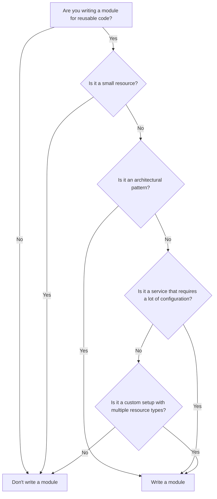

Below is a standard guide on determining when to make a Terraform module

```mermaid
graph TD;
    A[Are you writing a module for reusable code?] -->|Yes| B{Is it a small resource?};
    A -->|No| G;
    B -->|Yes| G;
    B -->|No| C{Is it an architectural pattern?};
    C -->|Yes| F;
    C -->|No| D{Is it a service that requires a lot of configuration?};
    D -->|Yes| F;
    D -->|No| E{Is it a custom setup with multiple resource types?};
    E -->|Yes| F;
    E -->|No| G;
    F[Write a module];
    G[Don't write a module];
```
