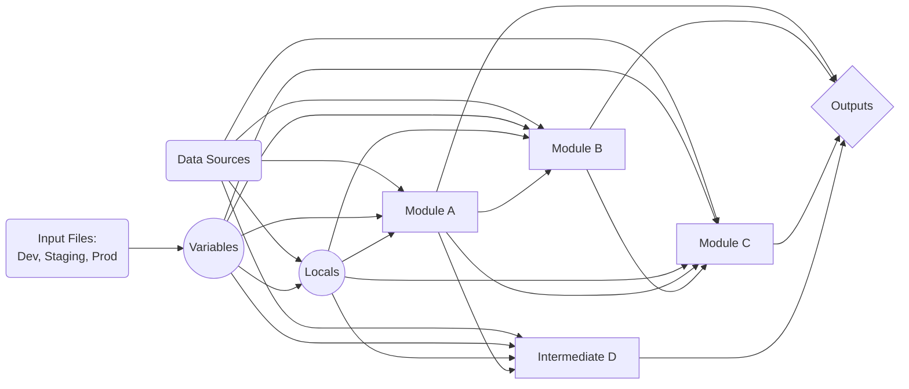
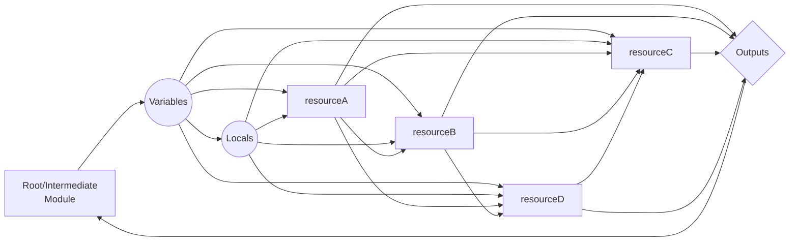
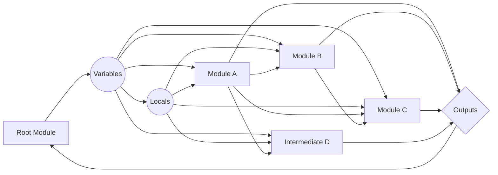

In the typical argument for development, when do you create `monolithic code` versus `modular code`?

The answer is simple:

Prefer modules when you are building reusable Terraform code. Modules allow you to encapsulate functionality, making code reusable and easier to maintain without forcing every repository to be a module-first architecture.

## Naming Conventions

Naming conventions are essential for maintaining clarity and consistency in your Terraform codebase. They help in identifying the purpose of modules, resources, and variables at a glance.

!!! note
	[Module Naming Convention Standards](module-naming-conventions.md){:target="_blank"}

## Root Modules (Architecture Layouts)

This is the top-level module that defines the overall architecture of your infrastructure.

As an Architecture repository, it should be designed in a manner that meets the technologies requirements, without being hardcoded to any specific configurations, other than the default values.

This allows us to develop in a [12factor.net](https://12factor.net/config){:target="_blank"} methodology/strategy. 

!!! Note "[12Factor: Config Rule](https://12factor.net/config){:target="_blank"}"
	Strict separation of config from code. Config varies substantially across deploys, code does not.

### __Classification - Deploy vs Config__

#### Config Module

See this module as a `Team Enablement`. Making it easier for a team to mass manage and maintain all of the resources they	need to operate, while also providing a consistent and repeatable setup for new teams.

* Used to setup all of the core functions of a team based on multiple technologies. 
* This repository is forked off to define a blueprint for a new team or account group setup, where you deploy a Terraform Cloud Workspace, a GitHub repository, Jira projects, and other necessary resources to get the team up and running.
* The goal is for it to produce a consistent and repeatable setup for new teams, allowing them to focus on their specific use cases without worrying about the underlying infrastructure.

The Config Root Module is critical to documenting the management layer and one of the first steps to an orchestration of process. It handles all of the governed criteria for getting any team or project off the ground, while being able to handle future growth and governance.

Sample: 
```
terraform-config-talos-mgmt
```

#### Deploy Module

See this module as a `Product Team Management`. Making it easier for a team to deploy and manage all of the resources they are experts over, while also providing a consistent and repeatable setups that bring down their means to time ratio of effort to delivery.

* Can be a byproduct of the `Config - Root Module` or a standalone module that is designed to deploy a specific technology or service, such as a VPC, Kubernetes cluster, or other infrastructure components.
* Designed around the Architecture of the system being deployed, and provides a consistent and repeatable setup for new teams.
* Should be designed with 12factor principles in mind, allowing for easy configuration and management of the underlying infrastructure, by allowing answer files to override the default values for different environments, such as Staging, Production, or Testing. 

The Deploy Root Module is critical to documenting architectures and reflecting their purposes and features. These are modules that deploy a consumable product to the business. 

Sample: 
```
terraform-deploy-control-room-mgmt
```
### __Design - OOTB vs Tailored__

#### __Out	of the Box (OOTB) - General Usage__

One method is to follow an Out of the Box (OOTB) approach, where the module is designed to be flexible and adaptable to various use cases. Out of the box, we'd expect a Development configurations to be in place, with all the required metadata to be applied. Answer files should then be used to override the default values for different environments, such as Staging, Production, or Testing.

This design allows you to get most of the requirements and functionality out of the gate, while also providing a consistent and repeatable setup for new teams. This also makes it easier to get consistency across	different teams and projects, as the module can be used as a starting point for new projects. This apparoach also allows you to quickly define outliers, and evaluate the need to add them as new features. Using an Agile approach, it will better allow you to iterate on the module and add new features as needed, without having to rewrite the entire module or fork off different versions for each team or project.

#### __Tailored design__

The other method is to follow a more traditional approach, where the module is designed to be used by a specific team or project, with hardcoded values for the default variables. This allows for a more streamlined setup, but may not be as flexible or adaptable to different use cases.

This method is useful when you have a specific use case in mind, and you want to ensure that the module is tailored to that use case. This can be useful for teams that have specific requirements or constraints that need to be met, and it allows for a more focused approach to the module design.

### __Rules for Root modules__

1. If the root module is to be used across `multiple teams`, then it must be `designed with no hardcoded values`, and instead rely on the use of bogus variables and data sources to provide the minimum necessary configuration to work out of the box and test
2. If the root module is specifically designed for a `single team`, then the default variables are `coded for the team's development requirements`.
3. The Default Variables should be asessed and resolve `input validation` to make sure users know what values they can use to override the defaults.
4. The module should handle all of the `data structures (interpolated via locals)`	that are required to implement the features, and should not rely on the user to provide any data structures.
5. `Testing` should usually be done with native Terraform tests that exercise example configurations, especially `examples/default/`, and should validate the module as a whole rather than isolated implementation details.
6. All `provider credentials should be dynamically generated where possible`, and handled by the environment, not the code (data sources, variables, locals, etc.).
7. `Data sources` should be used where possible to retrieve information about the environment, `rather than hardcoding values` in the module.
8. `Leverage metadata modules` as much as possible, to guarantee data is properly available and to reduce the amount of code that needs to be written.
9. Use a `feature/truth table` to handle all of the different components, so you can control the 

### __Root Module Structure__

The root module comprises of multiple modules that are designed to work together to provide a complete solution. The root module is the entry point for the architecture, and it should be designed to be flexible and adaptable to various use cases.



## __Modules - Reusable functions/libraries__

Modules are reusable components that can be used to encapsulate functionality and make it easier to manage and maintain your infrastructure code. They are designed to be used as building blocks for your infrastructure, allowing you to create complex architectures with minimal effort.

When a deployment of any technology is required, the module handles it's creation in a modular	way, allowing for easy configuration and management and allowing it to become a transport for stateful and immutable resources. 

A Module is a collection of resources, data sources, variables, outputs, and locals that are designed to work together to provide a specific function or set of features. What makes them most powerful is when they're designed to handle specific situations, as opposed to a generic shell that requires intimacy that prevented you from learning the technology in the first place. It's a stepping stone to learning and undersatnding technology in a digestible manner. 

!!! Note
	[Module Creation Decision Workflow](module-creation-workflow.md){:target="_blank"}

### __Rules for modules__

1. Use the `locals to sanitize all the inputs` to match the resource requirements
2. Make sure to merge the tags or unique	identifiers in the locals, so that the resources can be easily identified and managed from a central point, `wihtout having to alter the variable reference in multiple places`
3. Create a `strict variable dependency structure` that allows adapting of the data structures without compromising the module's functionality.
4. Use a `feature/truth table` to handle all of the functionality of the module. 
5. The core functionality of the module should be defined in the `main.tf` file, with all of the resources that are required to implement the features.
6. `Separate features` will use a `custom *.tf` file to allow that feature's logic and functionality to be defined in a single place.
7. Use the `variables.tf` file to define all of the variables that are required for the module, and make sure to include input validation where possible.
8. Use the `outputs.tf` file to define all of the outputs that are required for the module, and make sure to include any necessary metadata.
9. Create examples for the module in the `examples` directory, and make sure to create a test for each feature in the `tests` directory.
10. Keep examples runnable locally and use them as fixtures for tests when that makes the test path more deterministic.
11. Each example should have its own `README.md` that explains what the example does and includes `terraform-docs` markers so pre-commit can regenerate the documentation block automatically.
12. Terraform module repositories should run `pre-commit run --all-files` before opening a pull request.

### __Terraform Module Repository Layout__

A Terraform module repository should expose the module itself at the repository root, with supporting examples and tests alongside it:

- `main.tf`, `variables.tf`, `outputs.tf`, and `versions.tf` define the module
- `examples/` contains runnable example configurations
- `tests/` contains module tests that can run locally
- `README.md` documents the module and example usage
- `.pre-commit-config.yaml` enforces formatting, validation, and documentation generation

Examples should not rely on live provider resources unless the example is explicitly for integration testing. Prefer mock data and local execution paths so examples can support both documentation and testing.

For generated scaffolds, prefer `examples/default/` and `tests/default.tftest.hcl` as the baseline layout. Treat Terratest as an opt-in exception path rather than the default validation mechanism.

### __Module Structure__

The terraform module comprises of multiple resources (data, locals, resource, output, and variable) that are designed to work together to provide a function. The terraform module is the entry point for the architecture, and it should be designed to be flexible and adaptable to various use cases.



## __Intermediate Module__

Intermediate modules are similar to root modules, but unlike root modules, they are designed to be used as a standalone module. They are a cumulation of modules, designed in a way that mirrors the theme of an architecture that a root module	would be used for, but are not designed to be used by a root module to enable a specific feature/technology with very little configuration. 


### __Rules for Intermediate Modules__

1.	Intermediate modules will be designed to be used as a `standalone module`, and should primarily rely on modules to function.
2.	Intermediate modules will be designed to be used by a `root module`, and should not be used as a root module.
3. The module should represent an `architecture` for a feature that is `too complicated to be a module`, but `not complicated enough to be a root module`
4. No providers
5. No versions
6. Data sources will be limited and/or not used at all
7. `Variables` will be limited to the `minimum necessary` to function to hand off to the modules to run in a `specific configuration pattern`
8. The module will be single use as a `primary default feature`, and a boolean will entirely control the functionality of the module.

### __Intermetidate Module Structure__

The terraform module comprises of multiple resources (data, locals, resource, output, and variable) that are designed to work together to provide a function. The terraform module is the entry point for the architecture, and it should be designed to be flexible and adaptable to various use cases.


