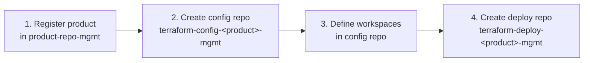
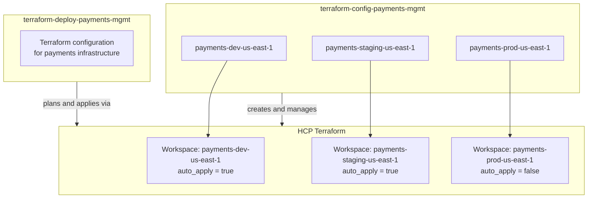

# New Product

This is the most involved tutorial — creating a new product from scratch means standing up the full three-layer scaffold: a product repo entry in `terraform-product-repo-mgmt`, a config management repo (`terraform-config-<product>-mgmt`), and a deploy repo (`terraform-deploy-<product>-mgmt`), with HCP Terraform workspaces per environment and region.

**Time to complete:** ~45–60 minutes across multiple PRs  
**Prerequisites:** [Developer Setup](../developer-setup/index.md) complete, AWS account(s) created via `terraform-aws-account-creation-mgmt`, access to HCP Terraform organisation

---

## Overview

Creating a new product involves four sequential steps, each in a separate pull request:



Each step depends on the previous one completing — do not skip ahead.

---

## Before You Start

Decide the following before opening any PRs:

| Decision | Example | Notes |
|----------|---------|-------|
| **Product name** | `payments` | Lowercase, no hyphens — used as the identifier throughout |
| **Environments** | `dev`, `staging`, `prod` | Which HCP Terraform workspaces to create |
| **Regions** | `us-east-1`, `eu-west-1` | Which AWS regions the product will be deployed to |
| **AWS accounts** | One per env, or shared dev | Confirm accounts exist in `terraform-aws-account-creation-mgmt` |
| **Jira epic** | `PLAT-400` | Create a Jira epic for the product setup — individual stories per step |

---

## Step 1 — Register the Product

Branch off `terraform-product-repo-mgmt` and add the product entry:

```bash
git clone git@github.com:rhughes1/terraform-product-repo-mgmt.git
cd terraform-product-repo-mgmt
git checkout -b feat/PLAT-401-add-payments-product
```

Add to `main.tf`:

```hcl
module "product_payments" {
  source  = "app.terraform.io/rhughes1/repository-files--product/github"
  version = "~> 1.0"

  product_name        = "payments"
  product_description = "Payment processing platform"
  topics              = ["payments", "product", "infrastructure"]
}
```

Open, review, and merge the PR:

```
feat: PLAT-401 register payments product
```

After apply, the product identifier `payments` is registered and the config and deploy management repo names are reserved.

---

## Step 2 — Create the Config Management Repository

The config repo is created by `terraform-product-repo-mgmt` via the product module — it bootstraps `terraform-config-payments-mgmt` with all standard files. Verify the repository exists on GitHub after Step 1's apply completes before continuing.

Clone the new config repo:

```bash
git clone git@github.com:rhughes1/terraform-config-payments-mgmt.git
cd terraform-config-payments-mgmt
git checkout -b feat/PLAT-402-define-payments-workspaces
```

---

## Step 3 — Define HCP Terraform Workspaces

The config repo manages the HCP Terraform workspaces for the product. Add workspace definitions to `main.tf`:

```hcl
locals {
  environments = ["dev", "staging", "prod"]
  regions      = ["us-east-1"]

  # Cartesian product of environments × regions
  workspaces = {
    for pair in setproduct(local.environments, local.regions) :
    "${pair[0]}-${pair[1]}" => {
      environment = pair[0]
      region      = pair[1]
    }
  }
}

module "payments_workspaces" {
  source   = "app.terraform.io/rhughes1/hcp-terraform-workspace/terraform"
  version  = "~> 1.0"
  for_each = local.workspaces

  workspace_name      = "payments-${each.key}"
  organization        = "rhughes1"
  project             = "payments"
  terraform_version   = "~> 1.9"
  working_directory   = "/"
  auto_apply          = each.value.environment == "prod" ? false : true

  variables = {
    aws_region      = each.value.region
    environment     = each.value.environment
    product         = "payments"
  }

  tags = [each.value.environment, each.value.region, "payments"]
}
```

This creates the following HCP Terraform workspaces:

- `payments-dev-us-east-1`
- `payments-staging-us-east-1`
- `payments-prod-us-east-1`

Open and merge the PR:

```
feat: PLAT-402 define payments HCP Terraform workspaces
```

After apply, the workspaces exist in HCP Terraform and are ready to accept Terraform runs.

---

## Step 4 — Create the Deploy Repository

The deploy repo is also bootstrapped by the product module from Step 1. Verify `terraform-deploy-payments-mgmt` exists on GitHub, then clone it:

```bash
git clone git@github.com:rhughes1/terraform-deploy-payments-mgmt.git
cd terraform-deploy-payments-mgmt
git checkout -b feat/PLAT-403-implement-payments-base-infrastructure
```

The deploy repo is associated to the workspaces created in Step 3. The `versions.tf` scaffolded by the bootstrapper includes the HCP Terraform cloud block:

```hcl
terraform {
  cloud {
    organization = "rhughes1"

    workspaces {
      tags = ["payments"]
    }
  }

  required_providers {
    aws = {
      source  = "hashicorp/aws"
      version = "~> 5.0"
    }
  }

  required_version = "~> 1.9"
}
```

The `tags = ["payments"]` binding associates this repository's runs to all workspaces tagged `payments` — which are the three workspaces created in Step 3.

Add infrastructure to `main.tf`, open a PR, and merge:

```
feat: PLAT-403 implement payments base infrastructure
```

The CD workflow triggers a `terraform plan` in HCP Terraform for each tagged workspace on PR open, and a `terraform apply` in the appropriate workspace on merge.

---

## Step 5 — AWS Account Bootstrap

If this product's AWS accounts have not been bootstrapped yet, run `terraform-aws-account-bootstrap` for each account. This applies standard IAM policies, service control policies, and base services defined in the bootstrap module.

```bash
git clone git@github.com:rhughes1/terraform-aws-account-bootstrap.git
cd terraform-aws-account-bootstrap
git checkout -b feat/PLAT-404-bootstrap-payments-accounts
```

Reference the account IDs from `terraform-aws-account-creation-mgmt` outputs and add bootstrap configuration for each payments account. Open and merge the PR.

---

## Workspace to Repository Mapping

Once all steps are complete, the relationship between repositories and workspaces looks like this:



---

## Checklist

- [ ] Product name decided — lowercase, no hyphens
- [ ] Environments and regions confirmed
- [ ] AWS accounts exist in `terraform-aws-account-creation-mgmt`
- [ ] Jira epic and stories created
- [ ] **Step 1:** Product registered in `terraform-product-repo-mgmt` — PR merged
- [ ] **Step 2:** `terraform-config-<product>-mgmt` repository exists on GitHub
- [ ] **Step 3:** HCP Terraform workspaces defined and created — PR merged
- [ ] **Step 4:** `terraform-deploy-<product>-mgmt` repository exists and has initial infrastructure — PR merged
- [ ] **Step 5:** AWS accounts bootstrapped via `terraform-aws-account-bootstrap`
- [ ] Workspaces visible in HCP Terraform with correct tags and variable sets
- [ ] First successful `terraform plan` in each workspace confirmed
- [ ] `prod` workspace verified as `auto_apply = false`
